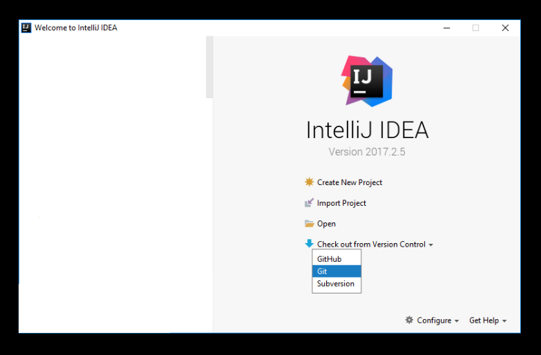
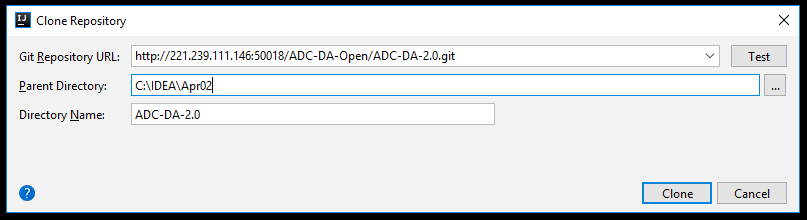
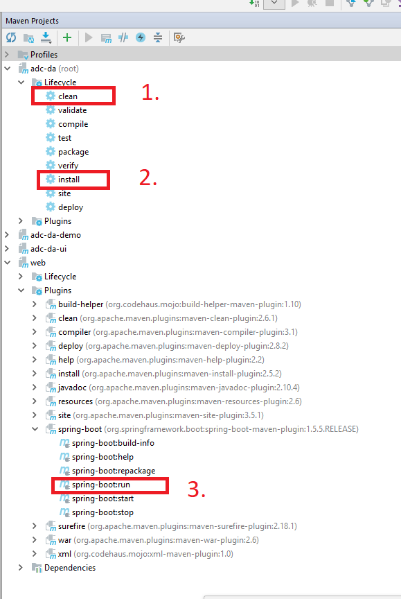
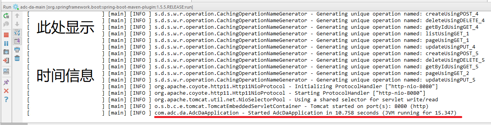
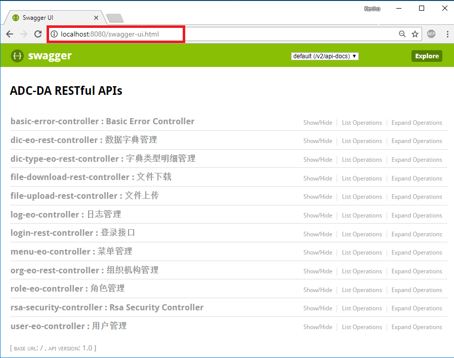
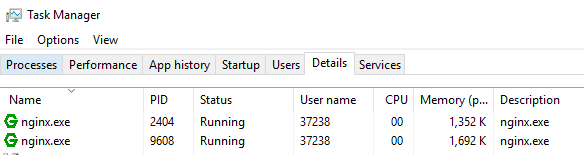

# 数据资源中心高效研发框架 **ADC-DA** 
## 1.官网地址
* http://221.239.111.146:50006/html/index.html

## 2.平台测试接口地址
* http://localhost:8080/swagger-ui.html


## 3.详细使用步骤/正在完善  （IDEA）
0. 详细文档请参考官网，以下仅用IDEA演示   
1. 获取源码方式有二   
 |-1. 用Git Bash git clone http://221.239.111.146:50018/ADC-DA-Open/ADC-DA-2.0.git   
 |-2. 用idea   
    

2. 启动平台 方法有二  
 |-1.从spring-boot：run启动   
   
 |-2.从AdcDaApplication启动 （可能需要修改pom.xml中的参数）   
    

* 若无法正常用idea运行，请将根目录下的pom.xml中的如下代码注释掉   
 ```xml
    <!-- Provided -->
    <dependency>
        <groupId>org.springframework.boot</groupId>
        <artifactId>spring-boot-starter-tomcat</artifactId>
        <scope>provided</scope>
        <version>${spring.boot.version}</version>
    </dependency>
 ``` 

3. 启动成功 访问swagger   
|-1.   
   
|-2.   
   
     
4. 启动nginx （待完善）  
    |-1. 配置nginx目录下conf目录中的nginx.conf文件，不要用记事本编辑conf文件，可以用写字板或其他编写代码的程序   
        |-1.1  需要配置的有 server，root，proxy_pass    
        
        server {
            listen       8011;
            #前端端口号 

            root C:/IDEA/test/ADC-DA-2.0/adc-da-ui/src/main/resources;
            #项目路径，定位到adc-da-ui/main/resources，注意"/"

            location / {

                # 动态页面 后端端口号
                if ( !-e $request_filename) {
                    proxy_pass       http://localhost:8080;
                }
                #root   html;
                #index  index.html index.htm;
            }
        }
    |-2.启动nginx 任务管理器-详细里面会有2个nginx信息
       

    |-3. 访问 http://localhost:8011/html/index.html   
       |-3.1 如果可以访问 http://localhost:8011/swagger-ui.html ，不能访问index.html，则一定是root路径错误。   
       |-3.2若可以访问 http://localhost:8080/swagger-ui.html ，不能访问 http://localhost:8011/swagger-ui.html ，则一定是端口配置错误。
